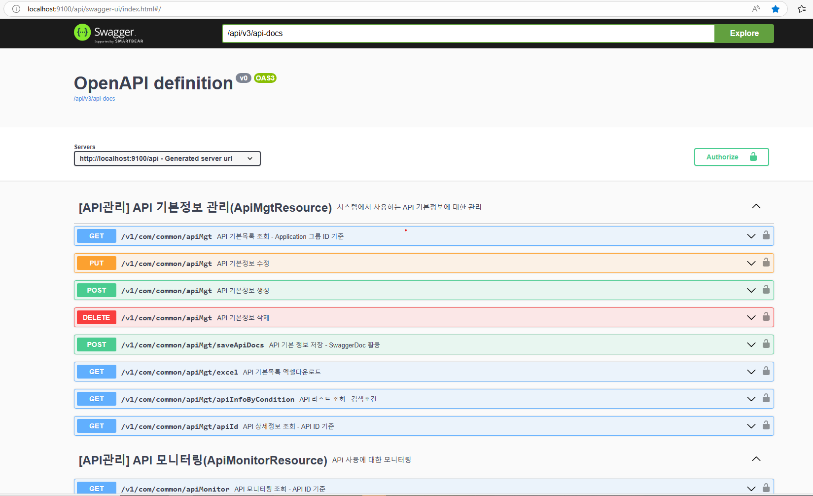
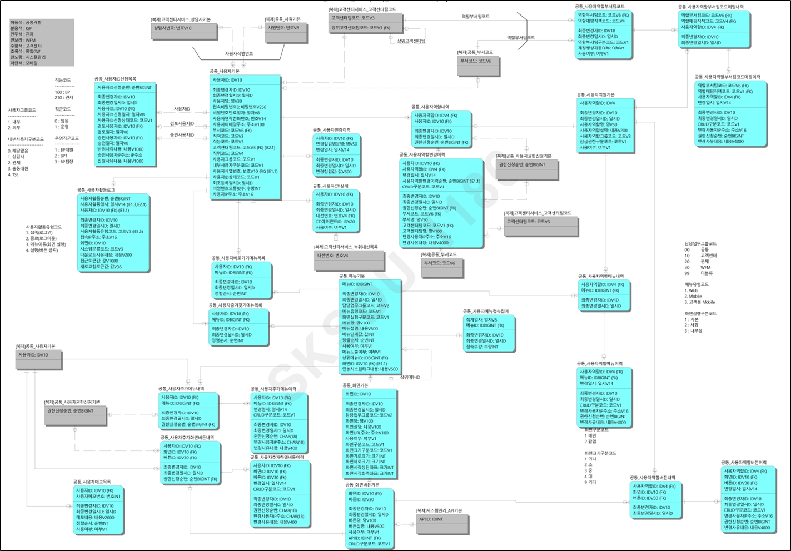

# SKCC KMS AI - RA-JAVA-FRAMEWORK-COMMON

## Introduction

Welcome to [RA-JAVA-FRAMEWORK-COMMON]! This project document will guide you through setting up the project, so you can get started quickly.
This project contains the following functions for common management: 
- Menu management
  - Provides menu management and basic menu settings based on tree structure
  - Manages screen information classified as main/popup, and maps screens to buttons
- API management
  - System call API basic information management
  - Usage history management for called APIs
- Other:
  - Code Management / File Management / Encryption, Decryption / Masking

## Prerequisites

- JDK 17 or higher
- Lombok
- Docker and Docker Compose
- Gradle 8.3 (or use the included Gradle wrapper)


## Project Structure

The project consists of the following modules:

- `common-service` - Main service implementation
- `common-export` - Common utilities and shared components

## Setup & Installation

1. Clone the repository:

```bash
git clone <repository-url>
cd common
```

2. Start the required services using Docker Compose:

```bash
# start services: zookeeper, kafka, kafka-ui, redis, mysql
docker-compose -f docker-compose.yml up -d
```

3. Start KeyCloak:

```bash
# start keycloak
docker-compose -f docker-compose-keycloak.yml up -d
```

4. Initialize the database:

```bash
# list all container
  docker ps

# run mysql container - change equivalent <container_id> value	
  docker exec -it <container_id> bash

# Login mysql
mysql -u root -p

# input MySql password

# Run the SQL files
# Create Database
CREATE DATABASE OCO;

# Create Account
CREATE USER 'com_dev'@'%' IDENTIFIED BY 'qwer1234!';

# Grant permission
GRANT ALL PRIVILEGES ON OCO.* TO 'com_dev'@'%’;

FLUSH PRIVILEGES;
```

5. Connect by IDE

You can also connect to the MySQL container using an IDE tool like MySQL Workbench or another IDE that supports MySQL.
The setup steps are as follows:

- Open MySQL Workbench or the IDE you want to use.
- Set up a new connection with the following information:
    - **Hostname**: 127.0.0.1 (localhost)
    - **Port**: 3306
    - **Database**: OCO
    - **Username**: root
    - **Password**: qwer1234!

- Test Connection: Check the connection to ensure you can access the MySQL server.
  You maybe need to set 'allowPublicKeyRetrieval=true' if necessary.

Once the connection is successful, you can use the graphical interface of the IDE to manage databases, perform SQL
queries, and interact with the data more easily.

6. Build the project:

```bash
./gradlew clean build
```

7. Enable swagger:

Comment these lines ```enabled: false``` in application.yml or change to ```enabled: true``` (for development only)

```code
springdoc:
  api-docs:
    ...
    enabled: false
  swagger-ui:
    ...
    enabled: false
```

## Running the Application

1. Start the service:

```bash
./gradlew :common-service:bootRun
```

2. The Swagger api will be available at `http://localhost:9100/api/com/common/swagger-ui/index.html`
   

## Development

- Use `./gradlew build` to build all modules
- Use `./gradlew test` to run tests
- Use `./gradlew bootRun` to run the service locally

## Database Setup

The project includes SQL scripts for initial setup:

- `query.sql` - Database dump
- `menu.sql` - Menu-related data

Logic ERD


Physic ERD


## Related Repositories

- [ra-java-framework-account](https://github.com/skccmygit/ra-java-framework-account)
- [ra-java-framework-work-batch](https://github.com/skccmygit/ra-java-framework-work-batch)
- [ra-java-api-gateway](https://github.com/skccmygit/ra-java-api-gateway)


## Additional Resources

- Check the README.md file for more detailed information
- Refer to individual module documentation for specific details
- See docker-compose files for infrastructure setup

## Troubleshooting

- If you encounter database connection issues, ensure the database container is running
- Check debug.log for detailed error messages