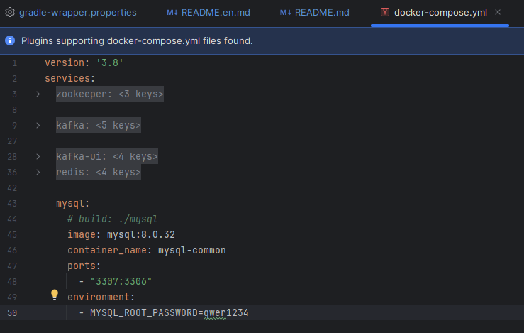
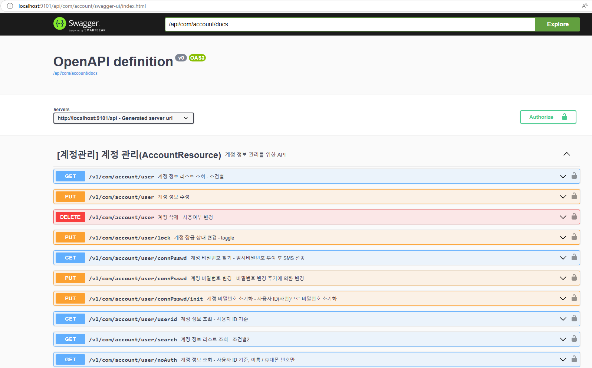
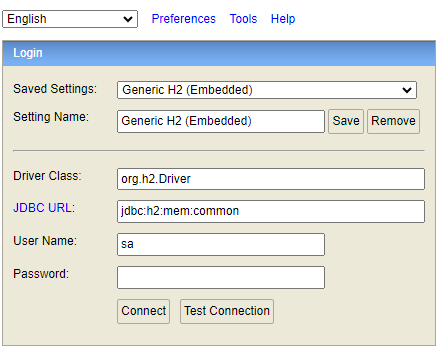

# System management - Common

## Introduction

This project is designed to streamline enterprise application development by offering common services and utilities across various modules.

Key features identified:
- **Common Service**  
  Provides menu management, code management, user activity logging, database routing, and utility APIs. Built with Spring Boot for easy integration.

- **Account Service**  
  Handles authentication, authorization, and management of user accounts across their entire lifecycle.

- **Core Utilities**  
  Provides utilities for Excel processing, data masking, tracing, etc.

- **Database and Configuration**  
  Local memory-based (H2) or external databases (MySQL, etc.) are supported, allowing flexible local development environment configuration through Gradle and Docker Compose.

- **API Documentation and Observability**  
  Integrates with Swagger/OpenAPI for REST endpoints and fosters real-time logging/tracing with simple toggles.

## Prerequisites

- JDK 17 or higher
- Lombok
- Docker and Docker Compose
- Gradle 8.3 (or use the included Gradle wrapper)


## Project Structure

The project consists of the following modules:

- `common-service` - Main service implementation
- `common-export` - Common utilities and shared components
- `account-service` - Main service implementation
- `account-export` - Contains shared DTOs and interfaces

## Installation and Setup

1. Clone the repository:

```bash
git clone <repository-url>
cd common
```

2. Start the required services using Docker Compose:

```bash
# start services: zookeeper, kafka, kafka-ui, redis, mysql
docker-compose -f docker-compose.yml up -d
```

3. Start KeyCloak:

```bash
# start keycloak
docker-compose -f docker-compose-keycloak.yml up -d
```

4. Initialize the database:

> [!NOTE]
> If you prefer to use the H2 database instead of mysql, please comment out the MySQL service in the docker-compose.yml file.
> Then, skip this step and proceed to the section titled "Running the Application with H2 Database."
>
> 

```bash
# list all container
  docker ps

# run mysql container
  docker exec -it mysql-common bash

# Login mysql
mysql -u root -p

# input MySql password in terminal (qwer1234)

# Run the SQL files
# Create Database
CREATE DATABASE OCO;

# Create Account
CREATE USER 'com_dev'@'%' IDENTIFIED BY 'qwer1234!';

# Grant permission
GRANT ALL PRIVILEGES ON OCO.* TO 'com_dev'@'%';

FLUSH PRIVILEGES;
```

5. Connect by IDE

You can also connect to the MySQL container using an IDE tool like MySQL Workbench or another IDE that supports MySQL.
The setup steps are as follows:

- Open MySQL Workbench or the IDE you want to use.
- Set up a new connection with the following information:
    - **Hostname**: 127.0.0.1 (localhost)
    - **Port**: 3307
    - **Database**: OCO
    - **Username**: root
    - **Password**: qwer1234!

- Test Connection: Check the connection to ensure you can access the MySQL server.
  You maybe need to set 'allowPublicKeyRetrieval=true' if necessary.

Once the connection is successful, you can use the graphical interface of the IDE to manage databases, perform SQL
queries, and interact with the data more easily.

After init schema and user, you must run sql script in 2 sql files (`query.sql`, `oif_query.sql`, `menu.sql` in the same folder of README).

First, run the script command in the `query.sql` file to create the tables.

Then, run the script command in the `oif_query.sql`

Then, run the script command in the `menu.sql` file to add sample data for the menu configuration.

6. Build the project:

```bash
./gradlew clean build
```

> [!NOTE]
> 
> In case you get error `./gradlew: Permission denied` you should try to run one of these command  
>
>    -``sudo chmod +x ./gradlew``
>    
>    -``git update-index --chmod=+x gradlew``
> 
> Then retry from step 2 above.

7. Enable swagger:

Comment these lines ```enabled: false``` in application.yml or change to ```enabled: true``` (for development only)

```code
springdoc:
  api-docs:
    ...
    enabled: false
  swagger-ui:
    ...
    enabled: false
```

## Running the Application

1. Start the Common Service:

```bash
./gradlew :common-service:bootRun
```

2. Start the Account Service:

```bash
./gradlew :account-service:bootRun
```

> [!NOTE]
>
> You can also run project in IDE likes IntelliJ, Eclipse, ...
> In case you get error when starting this project, you should check the project config:
> - JDK version
> - Gradle config
> - Proxy prevention
> - Try to remove '.gradle' folder inside project and rebuild gradle in step 2 (Build the project)

3. The Swagger Common API will be available at `http://localhost:9100/api/com/common/swagger-ui/index.html`
   

4. The Swagger Account Api will be available at `http://localhost:9101/api/com/account/swagger-ui/index.html`
   

> [!NOTE]
> For further details, please refer to the Postman collection located in the docs/postman folder.


## Running the Application with H2 Database

1. Start the Common Service:

```bash
./gradlew :common-service:bootRun -Pprofile=test
```

2. Start the Account Service:

```bash
./gradlew :account-service:bootRun -Pprofile=test
```

3. H2 Console for CommonService `http://localhost:9100/api/h2-console`
- Set up config login H2 Console:
  - **Saved Settings**: Generic H2 (Embedded)
  - **Setting Name**: Generic H2 (Embedded)
  - **Driver Class**: org.h2.Driver
  - **JDBC URL**: jdbc:h2:mem:common
  - **User Name**: sa
  - **Password**:
  - 

4. H2 Console for AccountService `http://localhost:9101/api/h2-console`
- Set up config login H2 Console:
  - **Saved Settings**: Generic H2 (Embedded)
  - **Setting Name**: Generic H2 (Embedded)
  - **Driver Class**: org.h2.Driver
  - **JDBC URL**: jdbc:h2:mem:common
  - **User Name**: sa
  - **Password**:
  - 

## Development

- Use `./gradlew build` to build all modules
- Use `./gradlew test` to run tests
- Use `./gradlew bootRun` to run the service locally

## Database Setup

The project includes SQL scripts for initial setup:

- `query.sql` - Database dump
- `oif_query.sql` - Database dump
- `menu.sql` - Menu-related data

Logic ERD


Physic ERD


## Related Repositories

- [ra-java-framework-work-batch](https://github.com/skccmygit/ra-java-framework-work-batch) API Log / Account Permission related batch
- [ra-java-api-gateway](https://github.com/skccmygit/ra-java-api-gateway) API Gateway

## Guide for Using the erd.json File
1. File location
```
    docs/
        ├── db/
        │   └── schema_*.erd.json
```

2. Install the `ERD Editor` Extension
- In VS Code:
  - Go to Extensions (left sidebar).
  - Search for “ERD Editor”.
  - Click Install.

3. Open `schema_*.erd.json` in the ERD Editor
- In VS Code’s Explorer, click on `schema_*.erd.json` then wait a moment for this extension rendering schema diagram.
- Visualize or edit your diagram. The tool should display entities and relationships.

## Instructions Test API
> [!NOTE] 
> The project includes SQL scripts to set up sample data for testing.
> Please import them into your database using the scripts provided in the directory described below
```
docs/
    ├── postman
    │   └── api-account-collection.postman.json
    │   └── api-common-collection.postman.json
    ├── test-api-instructions
    │   └── data-sample.sql
```

### API - Account Service

- API - View account information list
```
http://localhost:9101/api/v1/com/account/user/search?deptcdList=D001,D002&userNm=
```

```
http://localhost:9101/api/v1/com/account/user/search?deptcdList=D003&userNm=
```

### API - Common Service

- API - Menu Lookup - By Screen ID
```
http://localhost:9100/api/v1/com/common/menu/screnId?screnId=COM-PM0002
```

- API - Menu Details - By Menu ID
```
http://localhost:9100/api/v1/com/common/menu/dtl?menuId=COM-01-05-02
```

## Additional Resources

- Refer to individual module documentation for specific details
- See docker-compose files for infrastructure setup

## Troubleshooting

- If you encounter database connection issues, ensure the database container is running
- Check error log for detailed error messages in the console of IDE or file generated in the project directory.